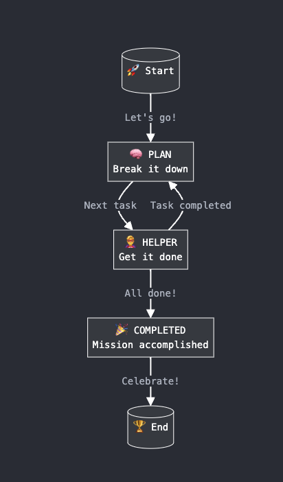

# Structured JSON is all you need

This project implements a multi-agent framework by modeling agents as Finite State Machines (FSM). OpenAI's Structured JSON offers a simpler way to create reliable agents without relying on complex beefy frameworks.

## Overview

The project uses a Planner-Executor model where:

1. The Planner agent breaks down complex objectives into manageable tasks.
2. The Executor agent completes individual tasks.
3. An Orchestrator manages the state transitions and coordinates between agents.

## Key Components

- `Orchestrator`: Manages the overall flow and state transitions.
- `Agent`: Represents either a Planner or Executor, interacting with OpenAI's API.
- `Memory`: Maintains the current state, task list, and other relevant information for orchestrator.
- `State`: Enum representing different states (PLAN, EXECUTE, COMPLETED).

## Flow Diagram




## How to Start the Project

1. Clone the repository:

   ```
   git clone https://github.com/yourusername/structured-json-agents.git
   cd structured-json-agents
   ```

2. Install dependencies:

   ```
   pip install -r requirements.txt
   ```

3. Set up your OpenAI API key:

   ```
   export OPENAI_API_KEY='your-api-key-here'
   ```

4. Run the main script:
   ```
   python main.py
   ```

## Project Structure

```
structured-json-agents/
├── agent/
│   └── agent.py
├── models/
│   └── models.py
├── orchestrator/
│   └── orchestrator.py
├── prompts/
│   └── prompts.py
├── main.py
└── README.md
```

